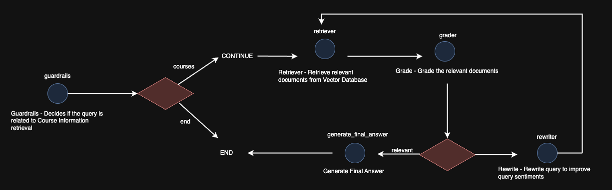

<div align = "center">
<h1>LangGraph: Multi-Agent Workflows</h1>
</div>

## Introduction
Agentic workflows fundamentally change how we interact with LLMs by making it an iterative process. Instead of one-shot prompt, users and LLMs engage in a back-and-forth conversations. Users start by providing an initial prompt, the LLM clarifies or asks questions, and then refines its responses based on this conversation. This collaborative approach goes beyond simply generating text – it allows for a more nuanced and effective use of LLMs. 

This workshop focuses on the basics of LangGraph – the framework for building agentic and multi-agent applications. LangGraph allows LLMs to determine the control flow of an application and building systems that reliably execute these tasks. Therefore, in this workshop, we will focus on creating an Question Answering application with AgenticRAG together with the introduction of basic LangGraph techniques.

This workshop will focus on leveraging LangGraph to create a basic chatbot:
- Introduction to LangGraph
- Hands-on walkthrough of functionalities of LangGraph
- Creation of AgenticRAG with LangGraph


 
## Setup and Installation
- Clone the repository:
```
git clone https://github.com/keenlim/CDEFG_workshop.git
cd CDEFG_codebase
```

- Download the entire repository from the CDEFG Teams channel folder as a Zip file.
- Unzip the file and open the file with VSCode

- To start, you need to first create a virtual environment and install all dependencies and all required libraries.
```
pip install virtualenv
python3.12 -m venv .venv
```

- Activate virtual environment and pip install all necessary requirements
#### For Mac
```
source .venv/bin/activate
pip install -r requirements.txt
```

#### For Windows
```
.venv\Scripts\activate 
pip install -r requirements.txt
```

- Setting up API Keys
Create the .env file and populate the keys shown in .env.sample

- Access the .ipynb notebook to try to run the notebook

## References
- [LangGraph](https://langchain-ai.github.io/langgraph/)
- [AgenticRAG](https://langchain-ai.github.io/langgraph/tutorials/rag/langgraph_agentic_rag/)
- [Intro of AI Agent, & AI agent projects summary](https://medium.com/@henryhengluo/intro-of-ai-agent-ai-agent-projects-summary-52f4a364ab86)
- [Understanding Agentic Concepts in LLM Workflows](https://medium.com/@pankaj_pandey/understanding-agentic-concepts-in-llm-workflows-fc8115504c06)
